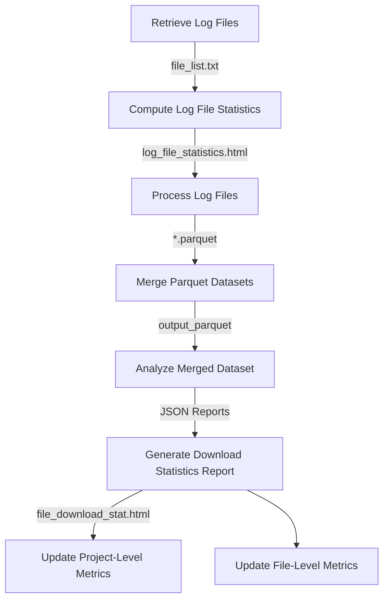

# file-download-stat

[](https://www.nextflow.io/)
[](https://docs.conda.io/en/latest/)
[](https://opensource.org/licenses/Apache-2.0)
[](https://cloud.seqera.io/launch?pipeline=https://github.com/PRIDE-Archive/file-download-stat)

# Introduction

The pipeline is built using Nextflow, a workflow tool to run tasks across multiple compute infrastructures in a very portable manner.
This pipeline get the statistics around file downloads from the log files saved in the EBI infrastructure.
This helps to understand the usage of the files and the projects, and helps to make decisions.

# Pipeline in Nutshell

## **Overview**
This pipeline automates log file retrieval, transformation, and statistical analysis, producing structured outputs for downstream analysis and database updates. It is optimized for high-throughput processing and large-scale data aggregation.

## **Workflow Steps**

1. **Retrieve Log Files (`get_log_files`)**  
   - Identifies and compiles a list of log files from the root directory.  
   - **Output:** `file_list.txt`

2. **Compute Log File Statistics (`run_log_file_stat`)**  
   - Performs statistical analysis on extracted log files.  
   - **Output:** `log_file_statistics.html`

3. **Process Log Files (`process_log_file`)**  
   - Extracts and transforms log data into Parquet format.  
   - **Output:** `*.parquet` files.

4. **Merge Parquet Datasets (`merge_parquet_files`)**  
   - Aggregates individual Parquet datasets into a consolidated dataset.  
   - **Output:** `output_parquet`

5. **Analyze Merged Dataset (`analyze_parquet_files`)**  
   - Conducts statistical analysis and generates JSON reports.  
   - **Outputs:**  
     - `project_level_download_counts.json`  
     - `file_level_download_counts.json`  
     - `project_level_yearly_download_counts.json`  
     - `project_level_top_download_counts.json`  
     - `all_data.json`

6. **Generate Download Statistics Report (`run_file_download_stat`)**  
   - Produces a visual analytics report in HTML format.  
   - **Output:** `file_download_stat.html`

7. **Update Project-Level Download Metrics (`update_project_download_counts`)**  
   - Uploads project-level statistics to a database.  
   - **Output:** `upload_response_file_downloads_per_project.txt`

8. **Update File-Level Download Metrics (`update_file_level_download_counts`)**  
   - Segments large JSON datasets for database ingestion.  
   - **Output:** Server response files confirming successful uploads.

## **Execution Flow**


## **Key Features**
- **Optimized for High-Throughput Processing**: Uses parallel computation and efficient storage formats (Parquet).
- **Modular Execution**: Each step can be run independently or as part of the full pipeline.
- **Database Integration**: Supports structured uploads of processed metrics.
- **Customizable Parameters**: Configurable via `params.yml`.

## Usage

### Install everything
```make install```

### Clean up
```make clean```

### Uninstall everything
```make uninstall```

### Run in EBI infastructure
```./run_download_stat.sh```

For step-by-step instructions, please refer to the [usage documentation](https://pride-archive.github.io/nf-downloadstats/get_started/installation/)

## Pipeline output

To see the results of an example test run with a full size dataset refer to the [Report](https://pride-archive.github.io/nf-downloadstats/report/report-interpretation/).

# Additional documentation and tutorial

For more details, please refer to the [Complete documentation](https://pride-archive.github.io/nf-downloadstats/)

# Contributions and Support

If you would like to contribute to this pipeline, please see the [contributing guidelines](.github/CONTRIBUTING.md).

For further information or help, don't hesitate to get in touch on the Slack at EBI.
