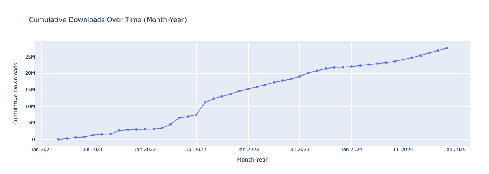
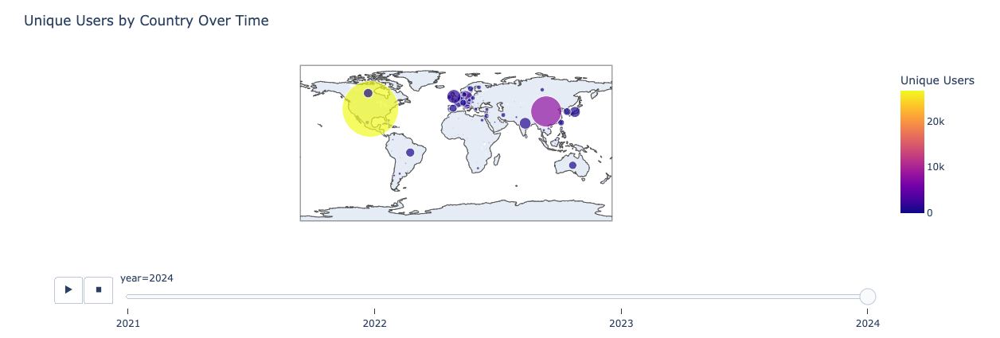

# Interpretation

## 1. Project Level Statistics

### Yearly Total Downloads Separated by Method (Including Totals)
- This bar chart displays yearly total downloads, separated by download methods: FTP, HTTP, and GridFTP-Globus.
- The highest number of downloads occurred in 2022, followed by 2023 and 2024.
- The GridFTP-Globus method was the most utilized, significantly contributing to the total downloads.

### Monthly Downloads: Total and by Method
- This line chart shows monthly download trends from 2021 onward.
- Peak download activity occurred around late 2022 and early 2023, with noticeable fluctuations across different months.
- All methods followed similar trends, with GridFTP-Globus consistently being the preferred choice.

### Cumulative Downloads Over Time (Month-Year)
- This plot tracks cumulative downloads over time, showing a steady increase in file retrievals.
- Significant jumps in cumulative downloads are observed around mid-2022 and early 2023, reflecting major surges in download activity.

### Distribution of Projects by Download Count
- This scatter plot illustrates the number of projects versus their download count.
- The majority of projects have fewer than 2,000 downloads, with only a few exceeding 10,000.
- This suggests that while a few projects are highly popular, most have moderate to low download counts.

---

## 2. Trends Statistics

### File Downloads Over Time
- This time-series graph shows daily downloads over the years.
- A significant spike in downloads is visible around mid-2022, followed by occasional surges in 2023 and 2024.
- HTTP downloads (red) show the highest fluctuations, while FTP and GridFTP-Globus exhibit steadier trends.

---

## 3. Regional Level Statistics

### Downloads by Country Over Time
- A world map visualizes download distributions across different countries.
- Larger circles indicate higher download volumes, with notable activity in regions such as North America, Europe, and Asia.
- The color gradient represents download intensity, with warmer colors indicating higher downloads.

---

## 4. User Level Statistics

### Unique Users Over Time
- This time-series graph shows the number of unique users downloading files over time.
- Similar to file downloads, user activity peaked in mid-2022 and late 2024.
- The graph indicates an increase in user engagement, especially during specific periods.

---

## Key Insights
- *2022 saw the highest number of downloads*, with a sharp increase in activity.
- *GridFTP-Globus remains the most preferred download method*.
- *The majority of projects have relatively low download counts*, with a few exceptions driving the highest traffic.
- *Download activity is concentrated in North America, Europe, and Asia*.
- *User engagement follows similar trends to total downloads*, with peaks in 2022 and 2024.